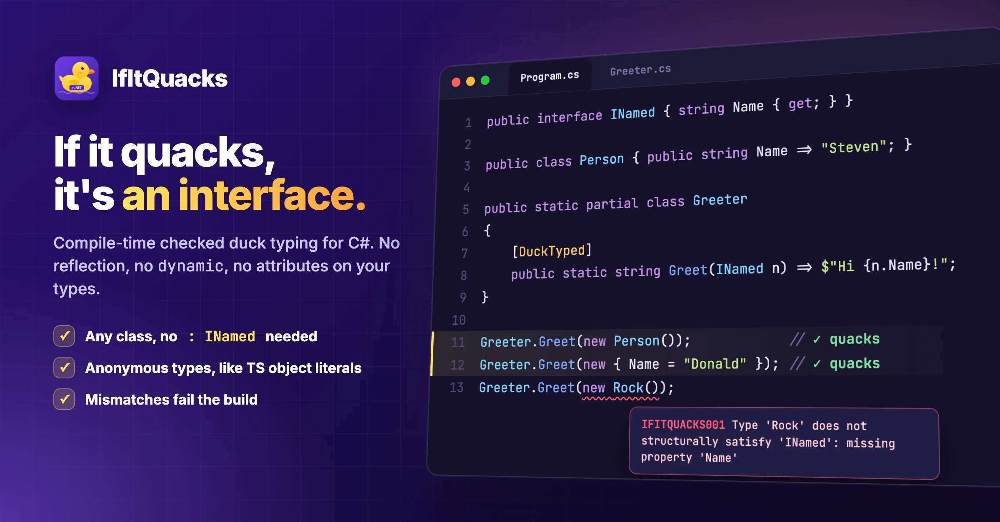

<p align="center">
  
</p>

<p align="center">
  
</p>

# IfItQuacks

[](https://www.nuget.org/packages/IfItQuacks/)
[](https://github.com/linkdotnet/IfItQuacks/releases)

Compile-time checked structural (duck) typing for C#: "If it walks like a duck and quacks like a duck, it's a duck."

## Getting Started

> PM> Install-Package IfItQuacks

Declare an interface, mark a method as duck-typed and pass in anything that fits - no attributes on the interface or the types:

```csharp
using IfItQuacks;

public interface INamed
{
    string Name { get; }
}

public class Person { public string Name => "Steven"; }
public class Mallard { public string Name => "Donald"; }

public partial class Greeter
{
    [DuckTyped]
    public string Greet(INamed first, INamed second, string greeting = "Hello") =>
        $"{greeting}, {first.Name} and {second.Name}!";
}

new Greeter().Greet(new Person(), new Mallard()); // Hello, Steven and Donald!
```

Neither `Person` nor `Mallard` implements `INamed`. The generator verifies at compile time that both have a matching `Name` and redirects the call through small generated adapters - no reflection, no `dynamic`. A type that doesn't fit is a build error.

To keep a duck-typed value around, convert it explicitly:

```csharp
List<INamed> names = [Duck.As<INamed>(new Person()), Duck.As<INamed>(new Mallard())];
```

## Highlights

### Anonymous types

Like object literals in TypeScript, anonymous types are ducks too - perfect for tests and quick stubs:

```csharp
new Greeter().Greet(new { Name = "Steven" }, new Mallard());

IPerson stub = Duck.As<IPerson>(new { Name = "Donald", Age = 90 });
```

### Compatible, not identical

Members only have to fit, just like an assignment would:

```csharp
public interface IInventory
{
    IEnumerable<string> Items { get; }
    long Count();
    void Add(string item);
}

public class Warehouse
{
    public List<string> Items { get; } = [];                  // List<string> -> IEnumerable<string>
    public int Count() => Items.Count;                        // int -> long
    public bool Add(object item) { Items.Add($"{item}"); return true; } // string -> object, result discarded
}
```

### Fields count as properties

```csharp
public class LegacyPerson { public string Name = ""; }

new Greeter().Greet(new LegacyPerson { Name = "Steven" }, new Mallard());
```

### Identity is preserved

Adapters forward `Equals`, `GetHashCode` and `ToString` to the original instance, so they work as dictionary keys and in sets. `Duck.Unwrap` gives you the original back:

```csharp
var person = new Person();
Duck.As<INamed>(person).Equals(Duck.As<INamed>(person)); // true
Duck.Unwrap(Duck.As<INamed>(person)) is Person;          // true
```

### And more

- Any interface works, including framework ones: `Duck.As<IDisposable>(x)`, `IEnumerable<T>` parameters, ...
- Interface parameters that don't need duck typing (an `ILogger`, say) keep accepting implementations, `null` and default values
- Generic interfaces (`IContainer<T>`) and generic `[DuckTyped]` methods with inferred type arguments
- Events, indexers and default interface members
- Instance and static methods, `ref`/`out`, `params`, default values and named arguments
- Zero setup: install the package, no project file changes

## Documentation

- [Getting started](https://linkdotnet.github.io/IfItQuacks/articles/getting_started.html)
- [How does it work?](https://linkdotnet.github.io/IfItQuacks/articles/concepts.html) - including what gets allocated
- [Diagnostics](https://linkdotnet.github.io/IfItQuacks/articles/diagnostics.html)
- [Known limitations](https://linkdotnet.github.io/IfItQuacks/articles/known_limitations.html)

Runnable examples live in [`samples`](samples).

## Support & Contributing

Thanks to all [contributors](https://github.com/linkdotnet/IfItQuacks/graphs/contributors) and people that are creating bug-reports and valuable input:

<a href="https://github.com/linkdotnet/IfItQuacks/graphs/contributors">
  
</a>
